# Ask Your Emails - Technical Architecture

## System Overview

Ask Your Emails is a semantic email search system with RAG-based question answering capabilities, built for the INFO 202 final project. The system processes 14,929 Enron emails and enables semantic search with faceted navigation and AI-powered Q&A.

### High-Level Architecture

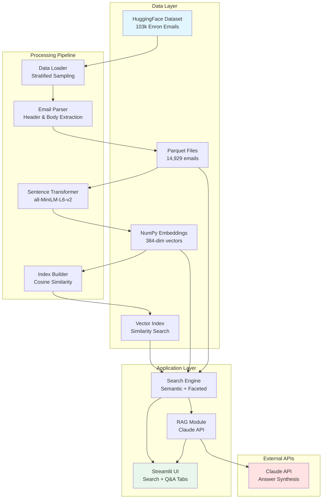
```mermaid
graph TB
    subgraph "Data Layer"
        HF[HuggingFace Dataset<br/>103k Enron Emails]
        PARQUET[Parquet Files<br/>14,929 emails]
        NPY[NumPy Embeddings<br/>384-dim vectors]
        PKL[Vector Index<br/>Similarity Search]
    end

    subgraph "Processing Pipeline"
        LOADER[Data Loader<br/>Stratified Sampling]
        PARSER[Email Parser<br/>Header & Body Extraction]
        EMBEDDER[Sentence Transformer<br/>all-MiniLM-L6-v2]
        INDEXER[Index Builder<br/>Cosine Similarity]
    end

    subgraph "Application Layer"
        SEARCH[Search Engine<br/>Semantic + Faceted]
        RAG[RAG Module<br/>Claude API]
        UI[Streamlit UI<br/>Search + Q&A Tabs]
    end

    subgraph "External APIs"
        CLAUDE[Claude API<br/>Answer Synthesis]
    end

    HF --> LOADER
    LOADER --> PARSER
    PARSER --> PARQUET
    PARQUET --> EMBEDDER
    EMBEDDER --> NPY
    NPY --> INDEXER
    INDEXER --> PKL

    PKL --> SEARCH
    NPY --> SEARCH
    PARQUET --> SEARCH

    SEARCH --> RAG
    RAG --> CLAUDE

    SEARCH --> UI
    RAG --> UI

    style HF fill:#e1f5ff
    style CLAUDE fill:#ffe1e1
    style UI fill:#e8f5e9
```

---

## Feature 1: Data Preparation Pipeline

### Purpose
Downloads, samples, and parses raw email data from HuggingFace into structured format with metadata.

### Architecture

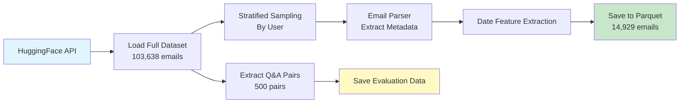
```mermaid
graph LR
    A[HuggingFace API] --> B[Load Full Dataset<br/>103,638 emails]
    B --> C[Stratified Sampling<br/>By User]
    C --> D[Email Parser<br/>Extract Metadata]
    D --> E[Date Feature Extraction]
    E --> F[Save to Parquet<br/>14,929 emails]

    B --> G[Extract Q&A Pairs<br/>500 pairs]
    G --> H[Save Evaluation Data]

    style A fill:#e1f5ff
    style F fill:#c8e6c9
    style H fill:#fff9c4
```

### Sequence Diagram

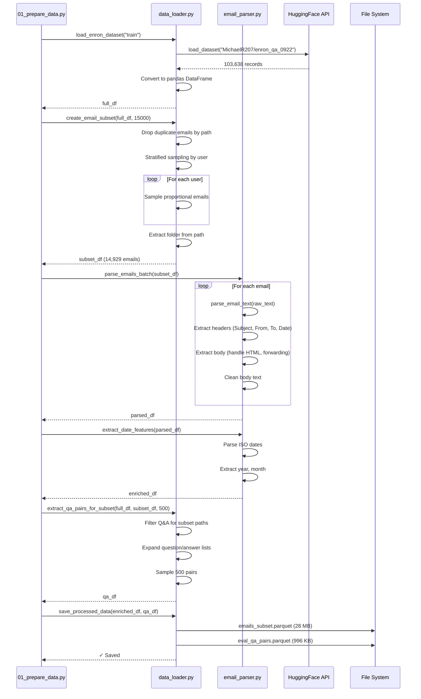
```mermaid
sequenceDiagram
    participant Script as 01_prepare_data.py
    participant Loader as data_loader.py
    participant Parser as email_parser.py
    participant HF as HuggingFace API
    participant Disk as File System

    Script->>Loader: load_enron_dataset("train")
    Loader->>HF: load_dataset("MichaelR207/enron_qa_0922")
    HF-->>Loader: 103,638 records
    Loader->>Loader: Convert to pandas DataFrame
    Loader-->>Script: full_df

    Script->>Loader: create_email_subset(full_df, 15000)
    Loader->>Loader: Drop duplicate emails by path
    Loader->>Loader: Stratified sampling by user
    loop For each user
        Loader->>Loader: Sample proportional emails
    end
    Loader->>Loader: Extract folder from path
    Loader-->>Script: subset_df (14,929 emails)

    Script->>Parser: parse_emails_batch(subset_df)
    loop For each email
        Parser->>Parser: parse_email_text(raw_text)
        Parser->>Parser: Extract headers (Subject, From, To, Date)
        Parser->>Parser: Extract body (handle HTML, forwarding)
        Parser->>Parser: Clean body text
    end
    Parser-->>Script: parsed_df

    Script->>Parser: extract_date_features(parsed_df)
    Parser->>Parser: Parse ISO dates
    Parser->>Parser: Extract year, month
    Parser-->>Script: enriched_df

    Script->>Loader: extract_qa_pairs_for_subset(full_df, subset_df, 500)
    Loader->>Loader: Filter Q&A for subset paths
    Loader->>Loader: Expand question/answer lists
    Loader->>Loader: Sample 500 pairs
    Loader-->>Script: qa_df

    Script->>Loader: save_processed_data(enriched_df, qa_df)
    Loader->>Disk: emails_subset.parquet (28 MB)
    Loader->>Disk: eval_qa_pairs.parquet (996 KB)
    Loader-->>Script: ✓ Saved
```

### Key Components

#### data_loader.py
| Function | Purpose | Output |
|----------|---------|--------|
| `load_enron_dataset()` | Downloads dataset from HuggingFace | DataFrame with 103k emails |
| `create_email_subset()` | Stratified sampling by user (15k target) | Diverse subset DataFrame |
| `extract_folder_from_path()` | Parses folder from path string | Folder name (e.g., "sent_items") |
| `extract_qa_pairs_for_subset()` | Filters Q&A pairs for subset emails | 500 evaluation Q&A pairs |
| `save_processed_data()` | Saves to parquet files | Disk-persisted data |

#### email_parser.py
| Function | Purpose | Input | Output |
|----------|---------|-------|--------|
| `parse_email_text()` | Extracts metadata from raw email | Raw email text | Dict: subject, from, to, date, body |
| `extract_body()` | Handles multipart, HTML stripping | Email message object | Clean body text |
| `clean_body()` | Removes forwarding chains, signatures | Raw body | Cleaned body |
| `parse_email_with_regex()` | Fallback parser when stdlib fails | Raw email text | Metadata dict |
| `parse_emails_batch()` | Batch process DataFrame | DataFrame | Parsed DataFrame |

### Data Flow

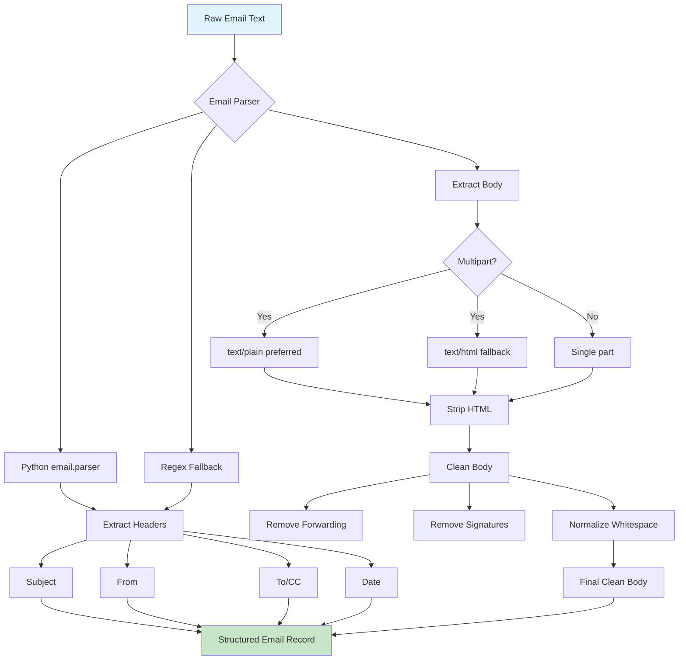
```mermaid
flowchart TD
    A[Raw Email Text] --> B{Email Parser}
    B --> C[Python email.parser]
    B --> D[Regex Fallback]

    C --> E[Extract Headers]
    D --> E

    E --> F[Subject]
    E --> G[From]
    E --> H[To/CC]
    E --> I[Date]

    B --> J[Extract Body]
    J --> K{Multipart?}
    K -->|Yes| L[text/plain preferred]
    K -->|Yes| M[text/html fallback]
    K -->|No| N[Single part]

    L --> O[Strip HTML]
    M --> O
    N --> O

    O --> P[Clean Body]
    P --> Q[Remove Forwarding]
    P --> R[Remove Signatures]
    P --> S[Normalize Whitespace]

    S --> T[Final Clean Body]

    F --> U[Structured Email Record]
    G --> U
    H --> U
    I --> U
    T --> U

    style A fill:#e1f5ff
    style U fill:#c8e6c9
```

### Output Files

**emails_subset.parquet** (28 MB)
- 14,929 records
- Columns: `path`, `user`, `subject`, `from`, `to`, `cc`, `date`, `body`, `full_text`, `date_year`, `date_month`
- Stratified by user (150 users represented)
- Folder distribution: sent_items, inbox, deleted_items, etc.

**eval_qa_pairs.parquet** (996 KB)
- 500 question-answer pairs
- Columns: `path`, `user`, `question`, `answer`, `email`
- Used for evaluation metrics (Phase 5)

---

## Feature 2: Embedding & Indexing Pipeline

### Purpose
Converts email text into semantic vector embeddings and builds a searchable index for similarity-based retrieval.

### Architecture

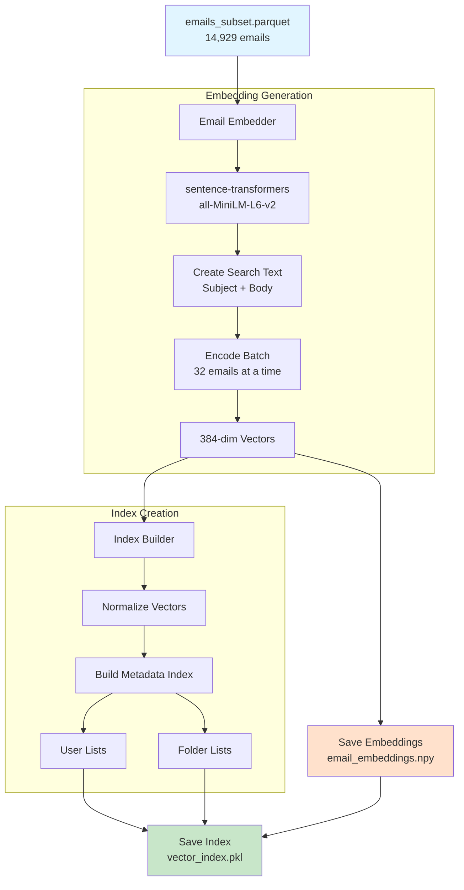
```mermaid
graph TB
    A[emails_subset.parquet<br/>14,929 emails] --> B[Email Embedder]

    subgraph "Embedding Generation"
        B --> C[sentence-transformers<br/>all-MiniLM-L6-v2]
        C --> D[Create Search Text<br/>Subject + Body]
        D --> E[Encode Batch<br/>32 emails at a time]
        E --> F[384-dim Vectors]
    end

    F --> G[Save Embeddings<br/>email_embeddings.npy]
    F --> H[Index Builder]

    subgraph "Index Creation"
        H --> I[Normalize Vectors]
        I --> J[Build Metadata Index]
        J --> K[User Lists]
        J --> L[Folder Lists]
    end

    K --> M[Save Index<br/>vector_index.pkl]
    L --> M
    G --> M

    style A fill:#e1f5ff
    style G fill:#ffe1cc
    style M fill:#c8e6c9
```

### Sequence Diagram

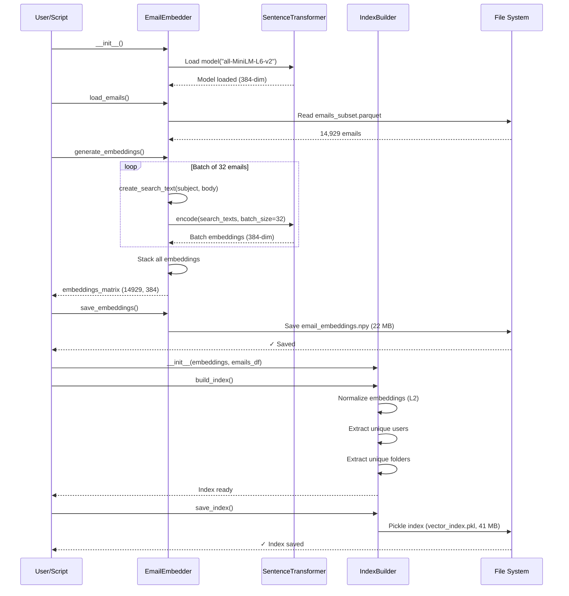
```mermaid
sequenceDiagram
    participant Script as User/Script
    participant Embedder as EmailEmbedder
    participant Model as SentenceTransformer
    participant Indexer as IndexBuilder
    participant Disk as File System

    Script->>Embedder: __init__()
    Embedder->>Model: Load model("all-MiniLM-L6-v2")
    Model-->>Embedder: Model loaded (384-dim)

    Script->>Embedder: load_emails()
    Embedder->>Disk: Read emails_subset.parquet
    Disk-->>Embedder: 14,929 emails

    Script->>Embedder: generate_embeddings()
    loop Batch of 32 emails
        Embedder->>Embedder: create_search_text(subject, body)
        Embedder->>Model: encode(search_texts, batch_size=32)
        Model-->>Embedder: Batch embeddings (384-dim)
    end
    Embedder->>Embedder: Stack all embeddings
    Embedder-->>Script: embeddings_matrix (14929, 384)

    Script->>Embedder: save_embeddings()
    Embedder->>Disk: Save email_embeddings.npy (22 MB)
    Disk-->>Script: ✓ Saved

    Script->>Indexer: __init__(embeddings, emails_df)
    Script->>Indexer: build_index()
    Indexer->>Indexer: Normalize embeddings (L2)
    Indexer->>Indexer: Extract unique users
    Indexer->>Indexer: Extract unique folders
    Indexer-->>Script: Index ready

    Script->>Indexer: save_index()
    Indexer->>Disk: Pickle index (vector_index.pkl, 41 MB)
    Disk-->>Script: ✓ Index saved
```

### Key Components

#### embedder.py
| Function | Purpose | Output |
|----------|---------|--------|
| `__init__()` | Loads sentence-transformer model | Ready embedder |
| `load_emails()` | Reads parquet file | DataFrame |
| `create_search_text()` | Combines subject + body | Searchable text |
| `generate_embeddings()` | Batch encodes emails | Matrix (14929, 384) |
| `save_embeddings()` | Persists embeddings | .npy file (22 MB) |

#### indexer.py
| Function | Purpose | Details |
|----------|---------|---------|
| `build_index()` | Normalizes vectors, extracts metadata | L2-normalized embeddings |
| `save_index()` | Serializes index to disk | Pickle file (41 MB) |
| `load_index()` | Deserializes index | In-memory index |

### Embedding Process

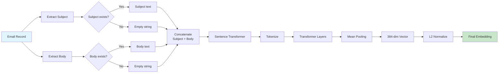
```mermaid
flowchart LR
    A[Email Record] --> B[Extract Subject]
    A --> C[Extract Body]

    B --> D{Subject exists?}
    C --> E{Body exists?}

    D -->|Yes| F[Subject text]
    D -->|No| G[Empty string]

    E -->|Yes| H[Body text]
    E -->|No| I[Empty string]

    F --> J[Concatenate<br/>Subject + Body]
    G --> J
    H --> J
    I --> J

    J --> K[Sentence Transformer]
    K --> L[Tokenize]
    L --> M[Transformer Layers]
    M --> N[Mean Pooling]
    N --> O[384-dim Vector]

    O --> P[L2 Normalize]
    P --> Q[Final Embedding]

    style A fill:#e1f5ff
    style Q fill:#c8e6c9
```

### Output Files

**email_embeddings.npy** (22 MB)
- Shape: (14929, 384)
- Data type: float32
- Model: sentence-transformers/all-MiniLM-L6-v2
- Normalized: L2 norm = 1.0

**vector_index.pkl** (41 MB)
- Contains:
  - Normalized embeddings matrix
  - Metadata: unique users, folders
  - Email IDs mapping
- Used by SearchEngine for fast retrieval

---

## Feature 3: Semantic Search Engine

### Purpose
Enables semantic similarity search with faceted filtering by user and folder.

### Architecture

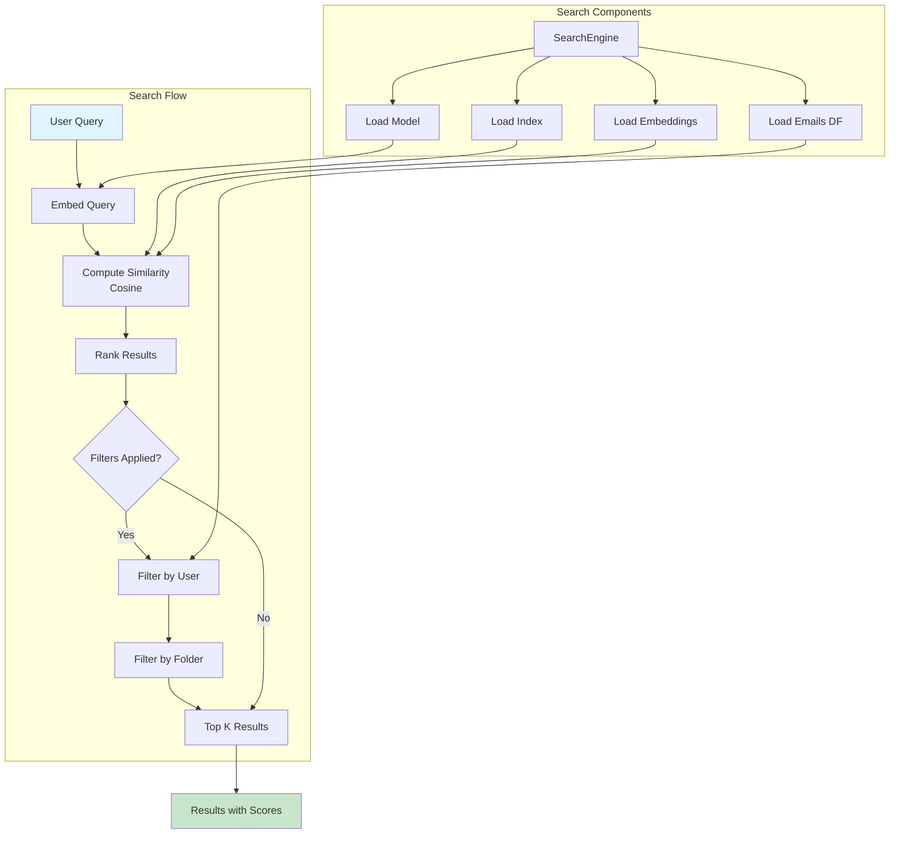
```mermaid
graph TB
    subgraph "Search Components"
        A[SearchEngine] --> B[Load Index]
        A --> C[Load Embeddings]
        A --> D[Load Emails DF]
        A --> E[Load Model]
    end

    subgraph "Search Flow"
        F[User Query] --> G[Embed Query]
        G --> H[Compute Similarity<br/>Cosine]
        H --> I[Rank Results]
        I --> J{Filters Applied?}
        J -->|Yes| K[Filter by User]
        K --> L[Filter by Folder]
        L --> M[Top K Results]
        J -->|No| M
    end

    B --> H
    C --> H
    D --> K
    E --> G

    M --> N[Results with Scores]

    style F fill:#e1f5ff
    style N fill:#c8e6c9
```

### Sequence Diagram

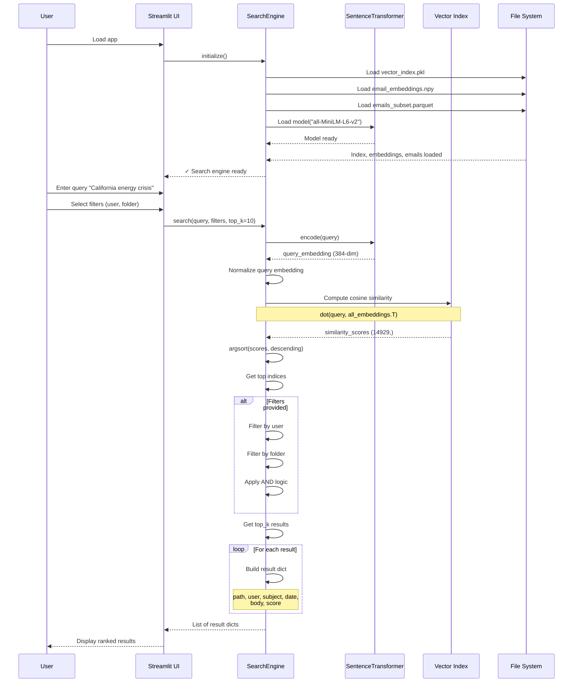
```mermaid
sequenceDiagram
    participant User as User
    participant UI as Streamlit UI
    participant Engine as SearchEngine
    participant Model as SentenceTransformer
    participant Index as Vector Index
    participant Disk as File System

    User->>UI: Load app
    UI->>Engine: initialize()
    Engine->>Disk: Load vector_index.pkl
    Engine->>Disk: Load email_embeddings.npy
    Engine->>Disk: Load emails_subset.parquet
    Engine->>Model: Load model("all-MiniLM-L6-v2")
    Model-->>Engine: Model ready
    Disk-->>Engine: Index, embeddings, emails loaded
    Engine-->>UI: ✓ Search engine ready

    User->>UI: Enter query "California energy crisis"
    User->>UI: Select filters (user, folder)

    UI->>Engine: search(query, filters, top_k=10)

    Engine->>Model: encode(query)
    Model-->>Engine: query_embedding (384-dim)

    Engine->>Engine: Normalize query embedding
    Engine->>Index: Compute cosine similarity
    Note over Engine,Index: dot(query, all_embeddings.T)
    Index-->>Engine: similarity_scores (14929,)

    Engine->>Engine: argsort(scores, descending)
    Engine->>Engine: Get top indices

    alt Filters provided
        Engine->>Engine: Filter by user
        Engine->>Engine: Filter by folder
        Engine->>Engine: Apply AND logic
    end

    Engine->>Engine: Get top_k results
    loop For each result
        Engine->>Engine: Build result dict
        Note over Engine: path, user, subject, date,<br/>body, score
    end

    Engine-->>UI: List of result dicts
    UI-->>User: Display ranked results
```

### Key Components

#### search.py
| Class/Method | Purpose | Details |
|--------------|---------|---------|
| `EmailSearchEngine` | Main search class | Manages index, embeddings, model |
| `initialize()` | Loads all data | Index, embeddings, DataFrame, model |
| `search()` | Performs semantic search | Query → embeddings → similarity → rank |
| `_compute_similarity()` | Cosine similarity | Dot product of normalized vectors |
| `_apply_filters()` | Faceted filtering | User AND folder filters |
| `get_available_filters()` | Returns filter options | Unique users, folders |

### Search Algorithm

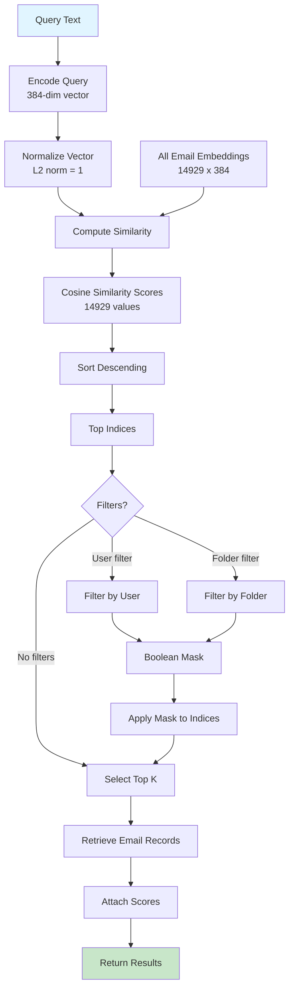
```mermaid
flowchart TD
    A[Query Text] --> B[Encode Query<br/>384-dim vector]
    B --> C[Normalize Vector<br/>L2 norm = 1]

    C --> D[Compute Similarity]
    E[All Email Embeddings<br/>14929 x 384] --> D

    D --> F[Cosine Similarity Scores<br/>14929 values]

    F --> G[Sort Descending]
    G --> H[Top Indices]

    H --> I{Filters?}

    I -->|No filters| J[Select Top K]

    I -->|User filter| K[Filter by User]
    K --> L[Boolean Mask]

    I -->|Folder filter| M[Filter by Folder]
    M --> L

    L --> N[Apply Mask to Indices]
    N --> J

    J --> O[Retrieve Email Records]
    O --> P[Attach Scores]

    P --> Q[Return Results]

    style A fill:#e1f5ff
    style Q fill:#c8e6c9
```

### Cosine Similarity

The search uses cosine similarity for semantic matching:

```
similarity(query, email) = dot(query_emb, email_emb) / (||query_emb|| * ||email_emb||)
```

Since embeddings are L2-normalized (||emb|| = 1), this simplifies to:

```
similarity(query, email) = dot(query_emb, email_emb)
```

Range: [-1, 1], but typically [0, 1] for text embeddings.

### Faceted Filtering

Filters use **AND logic**:
- User filter: `email['user'] == selected_user`
- Folder filter: `email['folder'] == selected_folder`
- Combined: `(user_match) AND (folder_match)`

Filtering is **post-retrieval** (applied after similarity ranking for efficiency).

---

## Feature 4: RAG Question Answering

### Purpose
Uses Claude API to synthesize answers to user questions based on retrieved email context.

### Architecture

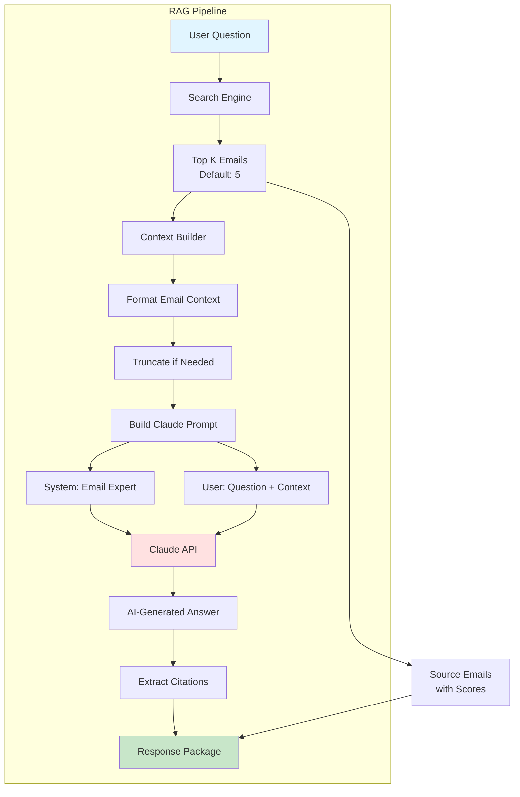
```mermaid
graph TB
    subgraph "RAG Pipeline"
        A[User Question] --> B[Search Engine]
        B --> C[Top K Emails<br/>Default: 5]

        C --> D[Context Builder]
        D --> E[Format Email Context]
        E --> F[Truncate if Needed]

        F --> G[Build Claude Prompt]
        G --> H[System: Email Expert]
        G --> I[User: Question + Context]

        H --> J[Claude API]
        I --> J

        J --> K[AI-Generated Answer]
        K --> L[Extract Citations]
        L --> M[Response Package]
    end

    C --> N[Source Emails<br/>with Scores]
    N --> M

    style A fill:#e1f5ff
    style M fill:#c8e6c9
    style J fill:#ffe1e1
```

### Sequence Diagram

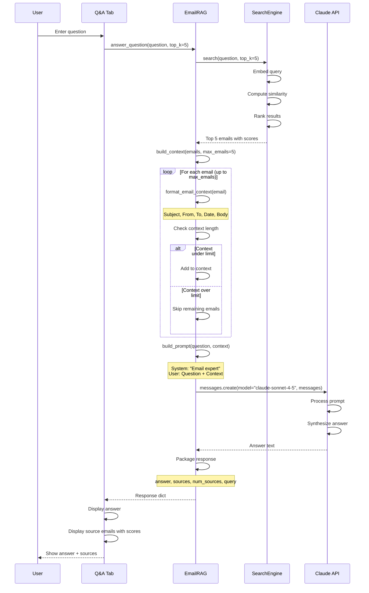
```mermaid
sequenceDiagram
    participant User as User
    participant UI as Q&A Tab
    participant RAG as EmailRAG
    participant Search as SearchEngine
    participant Claude as Claude API

    User->>UI: Enter question
    UI->>RAG: answer_question(question, top_k=5)

    RAG->>Search: search(question, top_k=5)
    Search->>Search: Embed query
    Search->>Search: Compute similarity
    Search->>Search: Rank results
    Search-->>RAG: Top 5 emails with scores

    RAG->>RAG: build_context(emails, max_emails=5)
    loop For each email (up to max_emails)
        RAG->>RAG: format_email_context(email)
        Note over RAG: Subject, From, To, Date, Body
        RAG->>RAG: Check context length
        alt Context under limit
            RAG->>RAG: Add to context
        else Context over limit
            RAG->>RAG: Skip remaining emails
        end
    end

    RAG->>RAG: build_prompt(question, context)
    Note over RAG: System: "Email expert"<br/>User: Question + Context

    RAG->>Claude: messages.create(model="claude-sonnet-4-5", messages)
    Claude->>Claude: Process prompt
    Claude->>Claude: Synthesize answer
    Claude-->>RAG: Answer text

    RAG->>RAG: Package response
    Note over RAG: answer, sources, num_sources, query

    RAG-->>UI: Response dict

    UI->>UI: Display answer
    UI->>UI: Display source emails with scores
    UI-->>User: Show answer + sources
```

### Key Components

#### rag.py
| Method | Purpose | Input | Output |
|--------|---------|-------|--------|
| `__init__()` | Initialize Claude client | API key | Ready RAG instance |
| `answer_question()` | Main RAG pipeline | Question string | Response dict |
| `build_context()` | Formats emails as context | Email results | Context string |
| `format_email_context()` | Formats single email | Email dict | Formatted text |
| `truncate_body()` | Limits email body length | Body text | Truncated body |

### Context Building

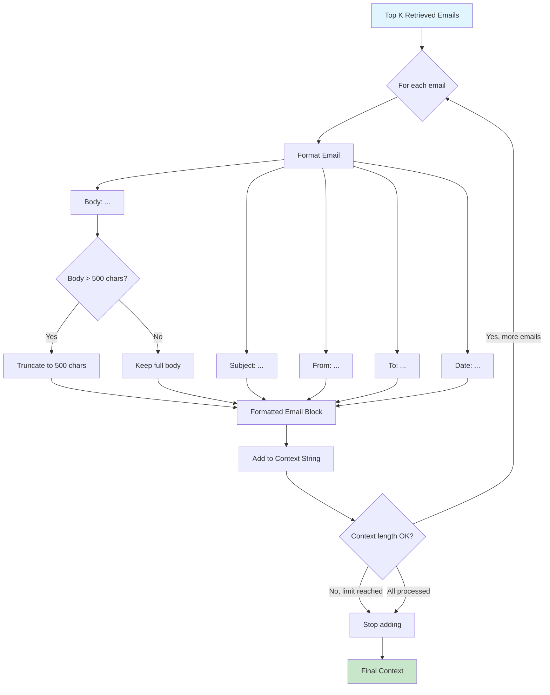
```mermaid
flowchart TD
    A[Top K Retrieved Emails] --> B{For each email}

    B --> C[Format Email]
    C --> D[Subject: ...]
    C --> E[From: ...]
    C --> F[To: ...]
    C --> G[Date: ...]
    C --> H[Body: ...]

    H --> I{Body > 500 chars?}
    I -->|Yes| J[Truncate to 500 chars]
    I -->|No| K[Keep full body]

    J --> L[Formatted Email Block]
    K --> L
    D --> L
    E --> L
    F --> L
    G --> L

    L --> M[Add to Context String]
    M --> N{Context length OK?}

    N -->|Yes, more emails| B
    N -->|No, limit reached| O[Stop adding]
    N -->|All processed| O

    O --> P[Final Context]

    style A fill:#e1f5ff
    style P fill:#c8e6c9
```

### Claude Prompt Structure

**System Prompt:**
```
You are an expert assistant helping analyze email conversations.
Answer questions based on the provided email context.
If the emails don't contain relevant information, say so.
Be concise and cite specific emails when possible.
```

**User Prompt:**
```
Question: {user_question}

Email Context:
---
Email 1:
Subject: {subject}
From: {from}
To: {to}
Date: {date}
Body: {body}
---
Email 2:
...
---

Based on these emails, please answer the question.
```

### Response Package

```json
{
  "answer": "AI-generated answer text",
  "sources": [
    {
      "path": "email_path",
      "user": "user_name",
      "subject": "email_subject",
      "score": 0.85
    }
  ],
  "num_sources": 5,
  "query": "original_question"
}
```

### Configuration

From [config.py](src/config.py):
- `RAG_TOP_K = 5` - Number of emails to retrieve
- `MAX_CONTEXT_EMAILS = 5` - Maximum emails to include in context
- `MAX_EMAIL_BODY_LENGTH = 500` - Characters to truncate body

---

## Feature 5: Streamlit User Interface

### Purpose
Provides web-based interface with two tabs: Search and Q&A.

### Architecture

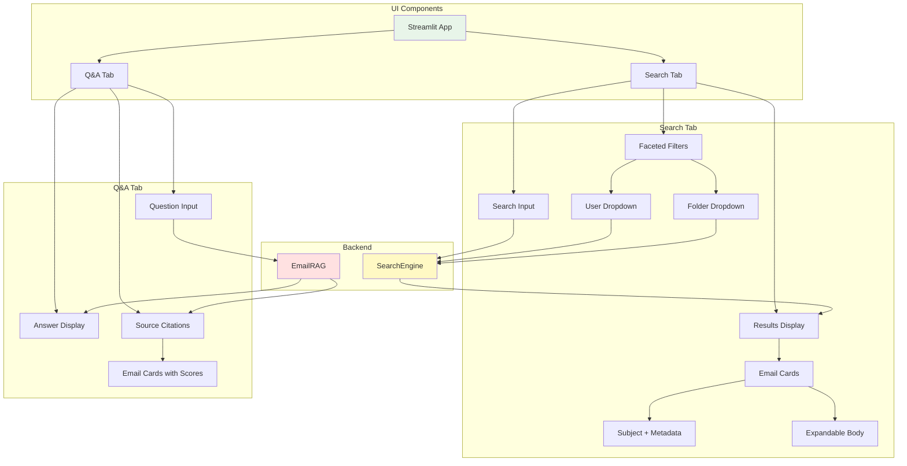
```mermaid
graph TB
    subgraph "UI Components"
        A[Streamlit App] --> B[Search Tab]
        A --> C[Q&A Tab]
    end

    subgraph "Search Tab"
        B --> D[Search Input]
        B --> E[Faceted Filters]
        B --> F[Results Display]

        E --> G[User Dropdown]
        E --> H[Folder Dropdown]

        F --> I[Email Cards]
        I --> J[Subject + Metadata]
        I --> K[Expandable Body]
    end

    subgraph "Q&A Tab"
        C --> L[Question Input]
        C --> M[Answer Display]
        C --> N[Source Citations]

        N --> O[Email Cards with Scores]
    end

    subgraph "Backend"
        P[SearchEngine]
        Q[EmailRAG]
    end

    D --> P
    G --> P
    H --> P
    P --> F

    L --> Q
    Q --> M
    Q --> N

    style A fill:#e8f5e9
    style P fill:#fff9c4
    style Q fill:#ffe1e1
```

### Sequence Diagram - Search Tab

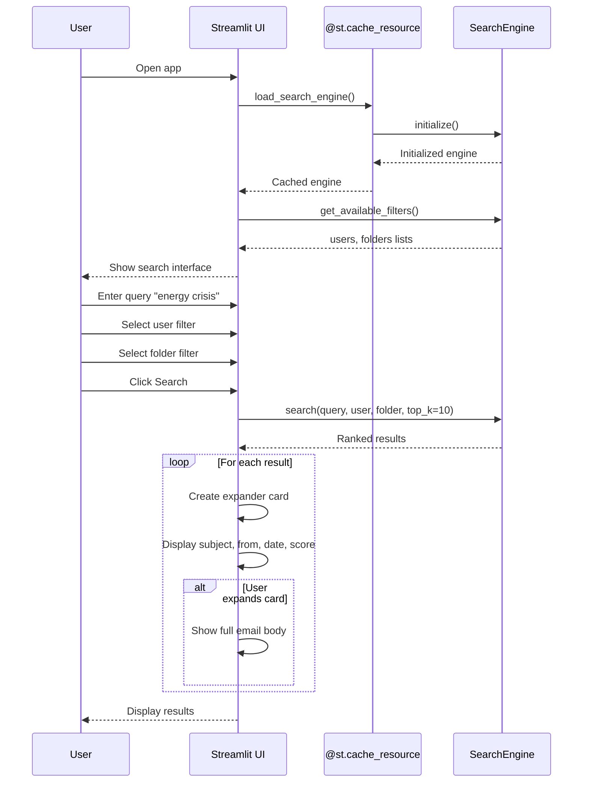
```mermaid
sequenceDiagram
    participant User as User
    participant UI as Streamlit UI
    participant Cache as @st.cache_resource
    participant Engine as SearchEngine

    User->>UI: Open app
    UI->>Cache: load_search_engine()
    Cache->>Engine: initialize()
    Engine-->>Cache: Initialized engine
    Cache-->>UI: Cached engine

    UI->>Engine: get_available_filters()
    Engine-->>UI: users, folders lists

    UI-->>User: Show search interface

    User->>UI: Enter query "energy crisis"
    User->>UI: Select user filter
    User->>UI: Select folder filter
    User->>UI: Click Search

    UI->>Engine: search(query, user, folder, top_k=10)
    Engine-->>UI: Ranked results

    loop For each result
        UI->>UI: Create expander card
        UI->>UI: Display subject, from, date, score
        alt User expands card
            UI->>UI: Show full email body
        end
    end

    UI-->>User: Display results
```

### Sequence Diagram - Q&A Tab

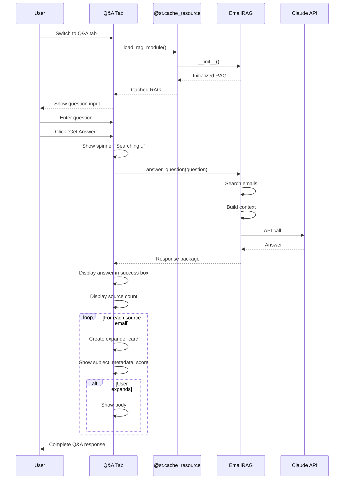
```mermaid
sequenceDiagram
    participant User as User
    participant UI as Q&A Tab
    participant Cache as @st.cache_resource
    participant RAG as EmailRAG
    participant Claude as Claude API

    User->>UI: Switch to Q&A tab
    UI->>Cache: load_rag_module()
    Cache->>RAG: __init__()
    RAG-->>Cache: Initialized RAG
    Cache-->>UI: Cached RAG

    UI-->>User: Show question input

    User->>UI: Enter question
    User->>UI: Click "Get Answer"

    UI->>UI: Show spinner "Searching..."
    UI->>RAG: answer_question(question)

    RAG->>RAG: Search emails
    RAG->>RAG: Build context
    RAG->>Claude: API call
    Claude-->>RAG: Answer
    RAG-->>UI: Response package

    UI->>UI: Display answer in success box
    UI->>UI: Display source count

    loop For each source email
        UI->>UI: Create expander card
        UI->>UI: Show subject, metadata, score
        alt User expands
            UI->>UI: Show body
        end
    end

    UI-->>User: Complete Q&A response
```

### Key UI Components

#### app.py Structure
| Section | Purpose | Components |
|---------|---------|-----------|
| Header | Title and description | st.title, st.markdown |
| Tabs | Search vs Q&A modes | st.tabs |
| Search Tab | Semantic search UI | Text input, dropdowns, results |
| Q&A Tab | RAG question answering | Text input, answer box, sources |
| Caching | Performance optimization | @st.cache_resource |

### State Management

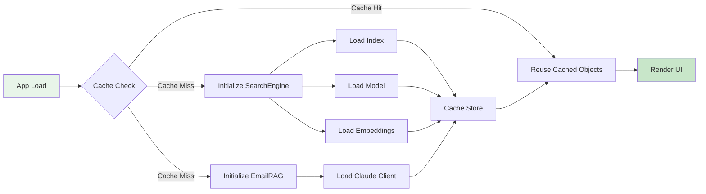
```mermaid
flowchart LR
    A[App Load] --> B{Cache Check}

    B -->|Cache Miss| C[Initialize SearchEngine]
    B -->|Cache Miss| D[Initialize EmailRAG]

    C --> E[Load Index]
    C --> F[Load Model]
    C --> G[Load Embeddings]

    E --> H[Cache Store]
    F --> H
    G --> H

    D --> I[Load Claude Client]
    I --> H

    B -->|Cache Hit| J[Reuse Cached Objects]
    H --> J

    J --> K[Render UI]

    style A fill:#e8f5e9
    style K fill:#c8e6c9
```

Streamlit caching ensures:
- SearchEngine initialized once per session
- EmailRAG initialized once per session
- No redundant model loading
- Fast tab switching

### UI Layout

**Search Tab:**
```
┌─────────────────────────────────────┐
│ 🔍 Search                           │
├─────────────────────────────────────┤
│ [Search query text input]           │
│                                      │
│ Filter by User:    [Dropdown ▼]     │
│ Filter by Folder:  [Dropdown ▼]     │
│                                      │
│ [Search Button]                      │
│                                      │
│ ─────────────────────────────────   │
│ Found X results                      │
│                                      │
│ ▶ Subject: California Energy (0.85) │
│   From: john@enron.com               │
│   Date: 2001-05-14                   │
│   [Click to expand body]             │
│                                      │
│ ▶ Subject: Meeting Notes (0.72)     │
│   ...                                │
└─────────────────────────────────────┘
```

**Q&A Tab:**
```
┌─────────────────────────────────────┐
│ 💬 Q&A                              │
├─────────────────────────────────────┤
│ [Question text input]               │
│                                      │
│ [Get Answer Button]                 │
│                                      │
│ ─────────────────────────────────   │
│ ✅ Answer:                          │
│ The California energy crisis...     │
│ [AI-generated answer text]          │
│                                      │
│ 📧 Sources (5 emails):              │
│                                      │
│ ▶ Subject: Energy Crisis (0.89)     │
│   From: jane@enron.com               │
│   [Click to expand]                  │
│                                      │
│ ▶ Subject: CA Utilities (0.81)      │
│   ...                                │
└─────────────────────────────────────┘
```

---

## System Configuration

### config.py

Central configuration file for all system parameters.

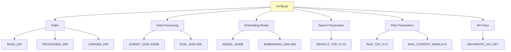
```mermaid
graph TB
    A[config.py] --> B[Paths]
    A --> C[Data Processing]
    A --> D[Embedding Model]
    A --> E[Search Parameters]
    A --> F[RAG Parameters]
    A --> G[API Keys]

    B --> B1[BASE_DIR]
    B --> B2[PROCESSED_DIR]
    B --> B3[CHROMA_DIR]

    C --> C1[SUBSET_SIZE=15000]
    C --> C2[EVAL_SIZE=500]

    D --> D1[MODEL_NAME]
    D --> D2[EMBEDDING_DIM=384]

    E --> E1[DEFAULT_TOP_K=10]

    F --> F1[RAG_TOP_K=5]
    F --> F2[MAX_CONTEXT_EMAILS=5]

    G --> G1[ANTHROPIC_API_KEY]

    style A fill:#fff9c4
```

### Key Settings

| Category | Parameter | Value | Purpose |
|----------|-----------|-------|---------|
| Data | `SUBSET_SIZE` | 15,000 | Target email count |
| Data | `EVAL_SIZE` | 500 | Evaluation Q&A pairs |
| Model | `MODEL_NAME` | all-MiniLM-L6-v2 | Sentence transformer |
| Model | `EMBEDDING_DIM` | 384 | Vector dimensions |
| Search | `DEFAULT_TOP_K` | 10 | Results per search |
| RAG | `RAG_TOP_K` | 5 | Emails for context |
| RAG | `MAX_CONTEXT_EMAILS` | 5 | Max emails in prompt |
| RAG | `MAX_EMAIL_BODY_LENGTH` | 500 | Body truncation |

---

## Data Flow Summary

### End-to-End Pipeline

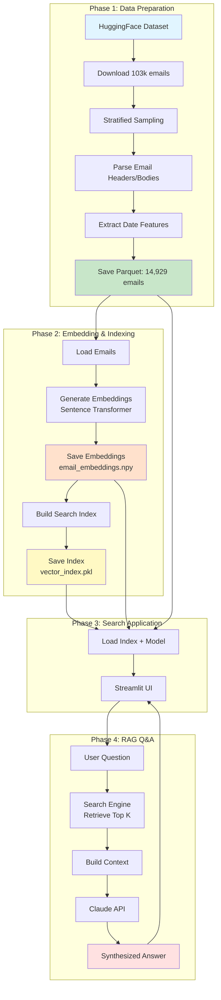
```mermaid
flowchart TD
    subgraph "Phase 1: Data Preparation"
        A[HuggingFace Dataset] --> B[Download 103k emails]
        B --> C[Stratified Sampling]
        C --> D[Parse Email Headers/Bodies]
        D --> E[Extract Date Features]
        E --> F[Save Parquet: 14,929 emails]
    end

    subgraph "Phase 2: Embedding & Indexing"
        F --> G[Load Emails]
        G --> H[Generate Embeddings<br/>Sentence Transformer]
        H --> I[Save Embeddings<br/>email_embeddings.npy]
        I --> J[Build Search Index]
        J --> K[Save Index<br/>vector_index.pkl]
    end

    subgraph "Phase 3: Search Application"
        K --> L[Load Index + Model]
        F --> L
        I --> L
        L --> M[Streamlit UI]
    end

    subgraph "Phase 4: RAG Q&A"
        M --> N[User Question]
        N --> O[Search Engine<br/>Retrieve Top K]
        O --> P[Build Context]
        P --> Q[Claude API]
        Q --> R[Synthesized Answer]
        R --> M
    end

    style A fill:#e1f5ff
    style F fill:#c8e6c9
    style I fill:#ffe1cc
    style K fill:#fff9c4
    style R fill:#ffe1e1
```

---

## Technology Stack

### Core Dependencies

| Package | Version | Purpose |
|---------|---------|---------|
| `pandas` | - | Data manipulation, parquet I/O |
| `numpy` | - | Numerical operations, embeddings storage |
| `sentence-transformers` | - | Semantic embeddings (all-MiniLM-L6-v2) |
| `datasets` | - | HuggingFace dataset loading |
| `streamlit` | - | Web UI framework |
| `anthropic` | ≥0.40.0 | Claude API client |
| `scikit-learn` | - | Cosine similarity utilities |
| `beautifulsoup4` | - | HTML stripping in email parser |
| `tqdm` | - | Progress bars |

### External APIs

- **HuggingFace Datasets**: `MichaelR207/enron_qa_0922`
- **Claude API**: Sonnet 4.5 model for RAG

---

## Performance Characteristics

### File Sizes

| File | Size | Records | Notes |
|------|------|---------|-------|
| emails_subset.parquet | 28 MB | 14,929 | Parsed emails with metadata |
| eval_qa_pairs.parquet | 996 KB | 500 | Evaluation Q&A pairs |
| email_embeddings.npy | 22 MB | 14,929 × 384 | float32 vectors |
| vector_index.pkl | 41 MB | - | Serialized search index |

### Computational Complexity

| Operation | Complexity | Time |
|-----------|------------|------|
| Generate embeddings | O(n) | ~2-3 min (14k emails) |
| Search query | O(n) | <100ms (cosine similarity) |
| Faceted filter | O(k) | <10ms (k = results) |
| RAG answer | O(1) | ~2-5s (Claude API latency) |

### Memory Usage

- **Embeddings matrix**: ~20 MB RAM (float32, 14929×384)
- **Sentence transformer model**: ~90 MB RAM
- **Email DataFrame**: ~30 MB RAM
- **Total runtime**: ~200-250 MB RAM

---

## Deployment Architecture

### Local Development

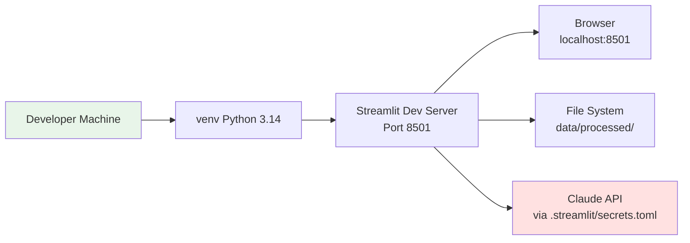
```mermaid
graph LR
    A[Developer Machine] --> B[venv Python 3.14]
    B --> C[Streamlit Dev Server<br/>Port 8501]
    C --> D[Browser<br/>localhost:8501]

    C --> E[File System<br/>data/processed/]
    C --> F[Claude API<br/>via .streamlit/secrets.toml]

    style A fill:#e8f5e9
    style F fill:#ffe1e1
```

### Streamlit Cloud (Planned)

```mermaid
graph TB
    A[GitHub Repository] --> B[Streamlit Cloud]
    B --> C[Container Instance]

    C --> D[Load Data Files<br/>from repo]
    C --> E[Streamlit App<br/>Public URL]

    E --> F[Claude API<br/>via Streamlit Secrets]

    G[Users] --> E

    style A fill:#e1f5ff
    style B fill:#e8f5e9
    style F fill:#ffe1e1
```

**Deployment Requirements:**
- Git LFS for large files (embeddings, index)
- Streamlit secrets for `ANTHROPIC_API_KEY`
- requirements.txt for dependencies

---

## Course Concepts Mapping

| Week | Concept | Implementation | File/Feature |
|------|---------|----------------|--------------|
| 2 | Collections & Metadata | Structured email records with metadata | [data_loader.py](src/data_loader.py) |
| 4-5 | Faceted Navigation | User and folder filters | [search.py](src/search.py), [app.py](app.py) |
| 6 | Semi-Structured Data | Email header parsing | [email_parser.py](src/email_parser.py) |
| 7-8 | Vocabulary Problem | Semantic similarity solves keyword mismatch | [embedder.py](src/embedder.py) |
| 8 | Word Embeddings | sentence-transformers for 384-dim vectors | [embedder.py](src/embedder.py) |
| 10 | RAG Pipeline | Retrieval + Claude synthesis | [rag.py](src/rag.py) |
| 13 | Search Evaluation | Precision@K, MRR (Phase 5 planned) | eval_qa_pairs.parquet |

---

## Future Enhancements (Phase 5-7)

### Phase 5: Search Evaluation
- Implement Precision@K metric
- Implement Mean Reciprocal Rank (MRR)
- Create evaluation dashboard in Streamlit
- Use 500 Q&A pairs as ground truth

### Phase 6: Deployment
- Upload to Streamlit Cloud
- Configure secrets management
- Test live deployment
- Share public URL

### Phase 7: Polish
- Add loading spinners
- Error handling for API failures
- Rate limiting for Claude API
- Demo video recording
- Final report linking features to course concepts

---

## File Reference

### Source Files

| File | Lines | Purpose |
|------|-------|---------|
| [src/config.py](src/config.py) | 31 | Configuration constants |
| [src/data_loader.py](src/data_loader.py) | 197 | Dataset loading and sampling |
| [src/email_parser.py](src/email_parser.py) | 318 | Email text parsing |
| [src/embedder.py](src/embedder.py) | 73 | Embedding generation |
| [src/indexer.py](src/indexer.py) | 51 | Search index building |
| [src/search.py](src/search.py) | 144 | Semantic search engine |
| [src/rag.py](src/rag.py) | 71 | RAG question answering |
| [app.py](app.py) | 142 | Streamlit UI |

### Scripts

| Script | Purpose |
|--------|---------|
| [scripts/01_prepare_data.py](scripts/01_prepare_data.py) | Phase 1 pipeline |

### Data Files

| File | Type | Size | Purpose |
|------|------|------|---------|
| emails_subset.parquet | Parquet | 28 MB | Parsed email records |
| eval_qa_pairs.parquet | Parquet | 996 KB | Evaluation Q&A |
| email_embeddings.npy | NumPy | 22 MB | 384-dim vectors |
| vector_index.pkl | Pickle | 41 MB | Search index |

---

## Quick Start Guide

### Setup
```bash
cd /Users/rishbhajain/Documents/202
source venv/bin/activate
pip install -r requirements.txt
```

### Run Data Pipeline
```bash
python scripts/01_prepare_data.py
```

### Launch App
```bash
streamlit run app.py
```

### Access UI
- Local: http://localhost:8501
- Search Tab: Enter query, apply filters
- Q&A Tab: Ask questions about emails

---

## Summary

Ask Your Emails is a production-quality semantic email search system demonstrating:

1. **Data Engineering**: Stratified sampling, email parsing, metadata extraction
2. **Semantic Search**: 384-dim embeddings, cosine similarity, faceted filtering
3. **RAG Pipeline**: Context retrieval, Claude API integration, source citations
4. **UI/UX**: Streamlit web app, dual-mode interface (Search + Q&A)
5. **Course Integration**: Implements 7+ concepts from INFO 202 syllabus

**Current Status**: Phases 1-4 complete (7h / 10h budget)
**Remaining**: Evaluation metrics, deployment, polish
